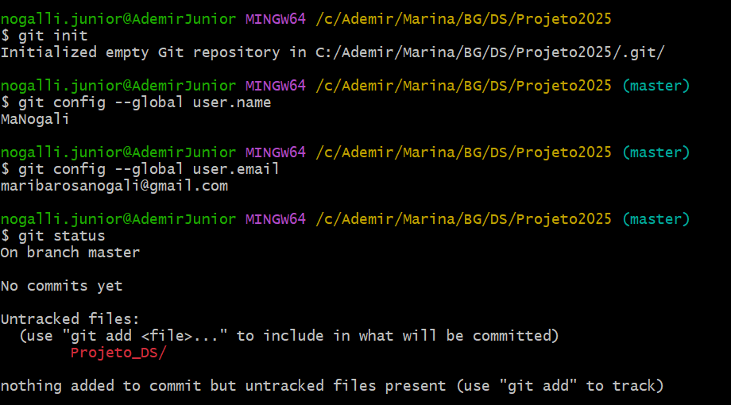
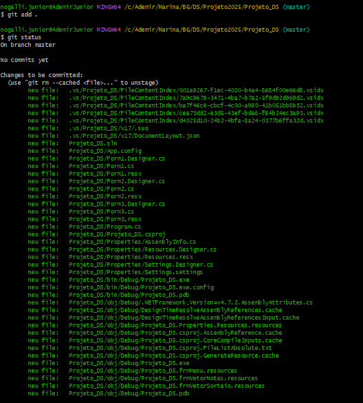
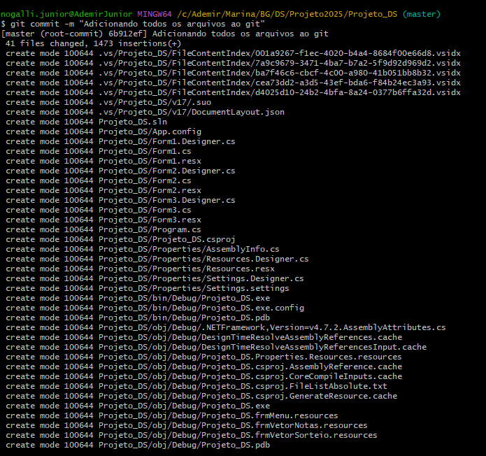
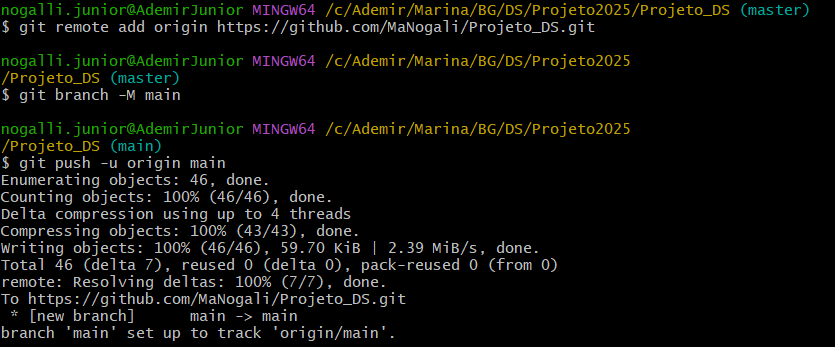

*Descrição Passo1: 'git init para inicializar o git, 'git config' para configurar o email e nome de usuário, e 'git status' para ver quais pastas serão adicionadas ao repsitório.*

*Descrição Passo2: 'git add .' para adicionar todos os arquivos ao git, e 'git status' para conferir que todos os arquivos forão adicionado corretamente.*

*Descrição Passo3: 'git commit' para salvar as alterações feitas e deixar uma mensagem explicando o que foi feito.*

*Descrição Passo4: 'git remote add origin' para adicionar o repositório local ao repositório remoto do link escrito, 'git branch -M main' para tranformar a branch master para main, e 
'git push -u origin main' para enviar as alterações feitas para a main.*
